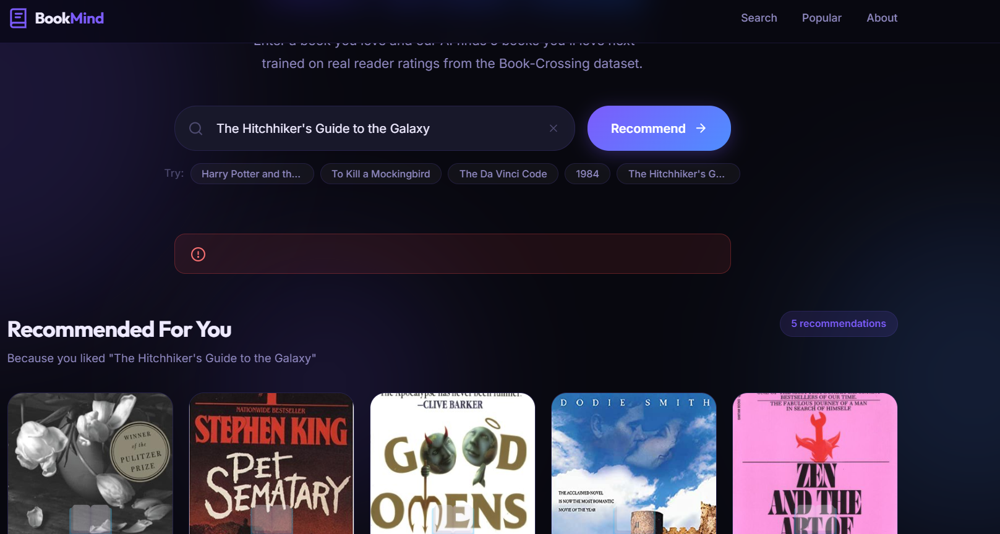
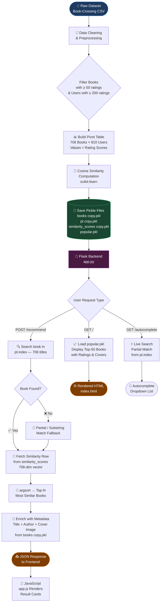

<div align="center">

# 📚 BookMind
### *AI-Powered Book Recommendation System*

[](https://python.org)
[](https://flask.palletsprojects.com)
[](https://docker.com)
[](https://scikit-learn.org)
[](LICENSE)

> *Discover your next favourite book using collaborative filtering on 271,360 real books from the Book-Crossing Dataset.*

</div>

---

## 🖼️ Project Screenshots

> 📌 **Paste your UI screenshots below** — replace the placeholder paths with your actual image files inside the `screenshots/` folder.

<div align="center">
<table>
  <tr>
    <td align="center">
      
      <br/>
      <sub><b>🏠 Home — Popular Books Feed</b></sub>
    </td>
    <td align="center">
      
      <br/>
      <sub><b>🤖 Recommendations Result View</b></sub>
    </td>
  </tr>
</table>
</div>

> 💡 **How to add screenshots:** Create a `screenshots/` folder in the project root, save your images as `ui-home.png` and `ui-recommend.png`, and they will automatically appear here.

---

## 🧠 ML Model Workflow



---

## 📌 Table of Contents

- [✨ Features](#-features)
- [🗂️ Project Structure](#️-project-structure)
- [🚀 Quick Start](#-quick-start)
- [🐳 Docker Guide](#-docker-guide)
- [🔌 API Reference](#-api-reference)
- [📊 Dataset & Model Details](#-dataset--model-details)
- [🛠️ Tech Stack](#️-tech-stack)
- [🤝 Contributing](#-contributing)
- [📄 License](#-license)

---

## ✨ Features

| Feature | Description |
|---------|-------------|
| 🤖 **AI Recommendations** | Collaborative filtering using cosine similarity on 706 books |
| 🔍 **Smart Autocomplete** | Real-time search with partial/case-insensitive matching |
| 📈 **Popular Books** | Top-50 books ranked by ratings count & average score |
| 🎨 **Dark UI** | Modern, responsive dark-themed interface |
| 🐳 **Docker Ready** | Single command deployment with Docker Compose |
| ⚡ **Fast API** | RESTful JSON endpoints for all recommendation operations |
| 📚 **Huge Dataset** | 271,360 books with covers, authors, and ISBN data |

---

## 🗂️ Project Structure

```
book-recomonder-system/
│
├── 📄 app.py                       # Flask backend — routes & recommendation logic
├── 📄 generate_model.py            # ML training script — generates all pkl files
├── 📄 requirements.txt             # Python dependencies
├── 🐳 Dockerfile                   # Docker image definition (multi-stage build)
├── 🐳 docker-compose.yml           # Docker Compose orchestration
├── 📄 .gitignore                   # Git exclusions (venv, large pkl files)
├── 📄 .dockerignore                # Docker build context exclusions
│
├── 📁 templates/
│   └── index.html                  # Jinja2 template — main UI
│
├── 📁 static/
│   ├── style.css                   # Dark theme, animations, responsive CSS
│   └── app.js                      # Autocomplete, fetch API, card rendering
│
├── 📁 model/                       # ⚠️ pkl files — NOT in Git (too large)
│   ├── books copy.pkl              # Full 271K books DataFrame (71 MB)
│   ├── pt copy.pkl                 # Pivot table 706×810 (4.4 MB)
│   ├── similarity_scores copy.pkl  # Cosine similarity 706×706 (3.8 MB)
│   └── popular.pkl                 # Top-50 popular books metadata
│
└── 📁 screenshots/                 # UI screenshots for README
    ├── ui-home.png                 # Paste your screenshot here
    └── ui-recommend.png            # Paste your screenshot here
```

---

## 🚀 Quick Start

### Option 1: 🐳 Docker *(Recommended — No Python setup needed)*

```bash
# 1. Clone the repository
git clone https://github.com/AnkitGit-prog/BookMind-recommendation-system.git
cd book-recomonder-system

# 2. Add your model pkl files to model/ directory
#    (see "Model Files" section below)

# 3. Build & Run — ONE command!
docker-compose up --build

# ✅ App is live at → http://localhost:5000
```

### Option 2: 🐍 Local Python

```bash
# 1. Clone the repository
git clone https://github.com/AnkitGit-prog/BookMind-recommendation-system.git
cd book-recomonder-system

# 2. Create & activate virtual environment
python -m venv .venv

# Windows
.venv\Scripts\activate

# Linux / macOS
source .venv/bin/activate

# 3. Install dependencies
pip install -r requirements.txt

# 4. Add pkl files to model/ directory

# 5. Run the app
python app.py
# ✅ App is live at → http://localhost:5000
```

---

## 🐳 Docker Guide

### Building & Running

```bash
# Build the Docker image
docker build -t bookmind .

# Run with volume mount (live model updates)
docker run -p 5000:5000 -v ./model:/app/model bookmind

# OR use Docker Compose (recommended)
docker-compose up --build          # Start in foreground
docker-compose up -d --build       # Start in background (detached)
docker-compose down                # Stop all containers
docker-compose logs -f bookmind    # Tail live logs
```

### Docker Architecture

```
┌─────────────────────────────────────────┐
│           Docker Container              │
│         (python:3.11-slim)              │
│                                         │
│  ┌──────────────────────────────────┐   │
│  │  Gunicorn WSGI Server            │   │
│  │  Workers: 2 | Timeout: 120s      │   │
│  │                                  │   │
│  │  ┌──────────────────────────┐    │   │
│  │  │  Flask App (app.py)      │    │   │
│  │  │  Port: 5000              │    │   │
│  │  └──────────────────────────┘    │   │
│  └──────────────────────────────────┘   │
│                                         │
│  Volume Mount: ./model → /app/model     │
└─────────────────────────────────────────┘
            ↕ Port 5000
    ┌─────────────────┐
    │   Your Browser  │
    │  localhost:5000  │
    └─────────────────┘
```

---

## 📦 Model Files

> ⚠️ Large pkl files are **excluded from Git** due to file size limits. You must add them manually.

### Generate from Scratch

```bash
# Requires Book-Crossing dataset CSV files
python generate_model.py
```

This will create all required `.pkl` files inside the `model/` directory.

### Model Files Summary

| File | Size | Description |
|------|------|-------------|
| `books copy.pkl` | ~71 MB | Full DataFrame — 271,360 books with Title, Author, Image URLs |
| `pt copy.pkl` | ~4.4 MB | Pivot Table — 706 books × 810 users, values = ratings |
| `similarity_scores copy.pkl` | ~3.8 MB | 706×706 cosine similarity matrix |
| `popular.pkl` | ~8 KB | Top-50 books with avg rating & rating count |

---

## 🔌 API Reference

### `GET /`
Renders the main UI with popular books.

---

### `POST /recommend`
Returns top-5 similar books for a given title.

**Request:**
```json
{
  "book_name": "Harry Potter and the Sorcerer's Stone"
}
```

**Response `200`:**
```json
{
  "query": "Harry Potter and the Sorcerer's Stone",
  "results": [
    {
      "title": "Harry Potter and the Chamber of Secrets",
      "author": "J. K. Rowling",
      "image": "https://images.amazon.com/images/P/...",
      "score": 0.9821
    },
    ...
  ]
}
```

**Response `404` (no match):**
```json
{
  "error": "No recommendations found for \"xyz\". Try another title."
}
```

---

### `GET /autocomplete?q=<query>`
Returns up to 10 matching book titles for live search.

**Request:** `GET /autocomplete?q=harry`

**Response:**
```json
[
  "Harry Potter and the Sorcerer's Stone",
  "Harry Potter and the Chamber of Secrets",
  "Harry Potter and the Prisoner of Azkaban"
]
```

---

## 📊 Dataset & Model Details

### Book-Crossing Dataset

| Metric | Value |
|--------|-------|
| Total Books | 271,360 |
| Total Users | 278,858 |
| Total Ratings | 1,149,780 |
| Filtered Books (model) | 706 (≥50 ratings) |
| Filtered Users (model) | 810 (≥200 ratings) |

### Algorithm: Collaborative Filtering

```
Step 1: Filter → Keep books with ≥50 ratings AND users with ≥200 ratings
Step 2: Pivot  → Create Book × User matrix (ratings as values)
Step 3: Similarity → Compute pairwise cosine similarity for all 706 books
Step 4: Query  → For input book, rank all 705 others by similarity score
Step 5: Enrich → Fetch Title, Author, Cover from full 271K dataset
```

**Why Cosine Similarity?**
- Measures the angle between two user-rating vectors
- Score of `1.0` = identical taste profile
- Score of `0.0` = completely different preference patterns
- Not affected by rating scale differences across users

---

## 🛠️ Tech Stack

| Layer | Technology | Version |
|-------|-----------|---------|
| **Language** | Python | 3.11 |
| **Web Framework** | Flask | 2.3+ |
| **Production Server** | Gunicorn | 21.2+ |
| **ML Library** | scikit-learn | 1.3+ |
| **Data Processing** | Pandas | 2.0+ |
| **Numerical Computing** | NumPy | 1.24+ |
| **Frontend** | HTML5 + CSS3 + Vanilla JS | — |
| **Containerization** | Docker + Docker Compose | — |
| **Dataset** | Book-Crossing Dataset | — |

---

## 🤝 Contributing

Contributions are welcome! Here's how:

```bash
# 1. Fork the repository on GitHub

# 2. Clone your fork
git clone https://github.com/AnkitGit-prog/BookMind-recommendation-system.git

# 3. Create a feature branch
git checkout -b feature/your-amazing-feature

# 4. Make your changes & commit
git add .
git commit -m "✨ Add: your amazing feature description"

# 5. Push to your fork
git push origin feature/your-amazing-feature

# 6. Open a Pull Request on GitHub
```

### Commit Message Convention

| Prefix | Usage |
|--------|-------|
| `✨ Add:` | New feature |
| `🐛 Fix:` | Bug fix |
| `📚 Docs:` | Documentation update |
| `🎨 Style:` | UI/CSS changes |
| `♻️ Refactor:` | Code refactoring |
| `🐳 Docker:` | Docker changes |

---

## 📄 License

This project is open source and available under the **MIT License**.

```
MIT License — Copyright (c) 2024
Permission is hereby granted, free of charge, to any person obtaining a copy
of this software... (see LICENSE file for full text)
```

---

<div align="center">

Made with ❤️ using **Flask** + **scikit-learn** + **Docker**

⭐ **Star this repo** if you found it helpful!
  <h1>Live demo link is here <p>https://bookmind-oylw.onrender.com</p></h1>

</div>
